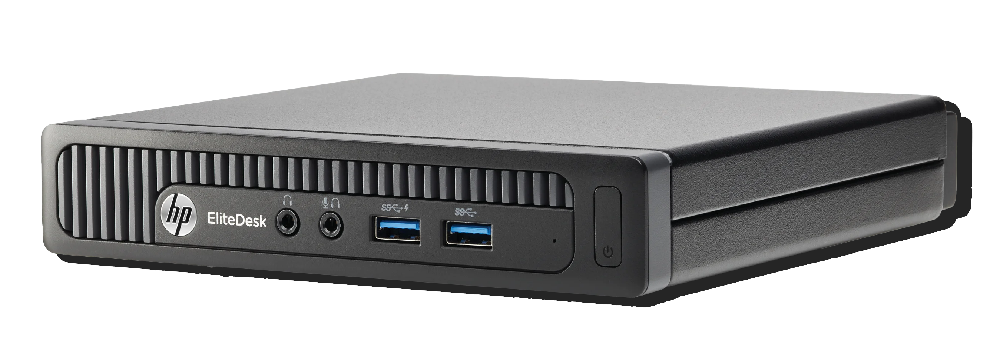

# HP Elitedesk 800 G1 Mini EFI

### 💻 Hardware

<strong>Show</strong>

 

| Component                      | Brand/info                                |
|--------------------------------|:-----------------------------------------:|
| **CPU**                        | `Intel® Core i5-4590T 2.0 GHz`|
| **iGPU**                       | `Intel HD Graphics 4600`                 |

### ⚠️ Not tested

<strong>Show</strong>

 

WiFi card

## ⚙️ Setup

<strong>🔧 BIOS Settings</strong>

 
Update bios to the latest version and set to default settings then follow
 
 

|    |                                 |
|----|:-------------------------------:|
| Security -> VTd | `Disabled` |
| Storage -> Storage Options -> SATA Emulation | `AHCI` |
| *Recommended* Power->Thermal->Fan Idle Mode | `lowest` |

<strong>🗒 Installation</strong>

|    |                                 |
|----|:-------------------------------:|
| 1. | Install MacOS on a usb (search online many ways to do it)|
| 2. | Place the EFI folder into the EFI partition|
| 3. | Setup SMBIOS [Follow this Part of the Guide](https://dortania.github.io/OpenCore-Post-Install/universal/iservices.html#using-gensmbios) enter `Macmini8,1 10` in GenSMBIOS|
| 4. | [continue that guide from here](https://dortania.github.io/OpenCore-Post-Install/universal/iservices.html#serial-number-validity)|
| 5. | After you have replaced the SMBIOS files boot from the USB, Format your ssd, and install MacOS|
| 6. | Once MacOS is installed, download [OpenCore Legacy Patcher (OpenCore-Patcher-GUI.app.zip)](https://github.com/dortania/OpenCore-Legacy-Patcher/releases/tag/0.6.7)|
| 7. | Click "Post install root patch" then click "start root patching" (this will be used to install the gpu drivers)|
| 8. | Select reset nvram from the boot menu (of OC) and boot into MacOS|

<strong>🗒 How to boot without the USB</strong>

  
|    |                                 |
|----|:-------------------------------:|
| 1. | [Download OpenCore Configurator](https://mackie100projects.altervista.org/download-opencore-configurator/)|
| 2. | Click Tools (from the top menu)>Mount EFI|
| 3. | Click Mount Partition for both the USB and the system SSD|
| 4. | Copy the files inside the EFI folder on the USB and place them inside the EFI folder on the system SSD |
| 5. | Thats it! everything should work now|

## ⭐️ Credits

 

[hp_800_g1_mini_hackintosh By asle](https://github.com/asle/hp_800_g1_mini_hackintosh)
 
[Donw35 on InsanelyMac](https://www.insanelymac.com/forum/topic/323180-ventura-monterey-big-sur-catalina-mojave-high-sierra-on-hp-800-g1-usdtsff-and-tower-pcs/)
 

  

